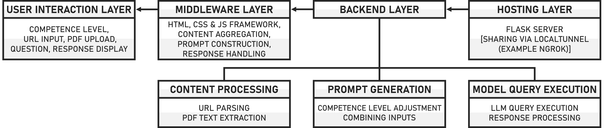

# IEC V1.5 APP
## Individual Educational Chatbot

This repository, developed by Stefan Pietrusky, is based on the article published at [Level Up Coding](https://medium.com/gitconnected/iec-v1-5-individual-educational-chatbot-f859456ec760). In this article, I describe the functionality of an enhanced version (V1.5) of the IEC application. The first version has already been tested and provided important results for improvement. The function of controlling the response level of the model used by clicking a button was very well received by the test subjects [[1]](https://arxiv.org/abs/2412.16165). In the extended application, the Gradio framework is no longer used, but the interface is implemented with HTML, CSS and JS. The level prompts have been optimized. The extraction of content has also been optimized. This is an open source project for educational and research purposes.

## IEC Structure


## IEC working principle
Below is a short GIF showing the structure and function of the app.


## IEC availability
The code to run the app is already in the repository.To make the app available via the Internet and not be restricted to the local network, a tunnel tool such as ngrok must be used! Your own computer becomes the server.


## Installing and running the application 
1. Clone this repository on your local computer: 
```bash 
git clone https://github.com/stefanpietrusky/iecv1.5.git
```
2. Install the required dependencies:
```bash 
pip install -r requirements.txt
```
3. Install Ollama and load the model [Llama3.1](https://ollama.com/library/llama3.1) (8B). Alternatively, another model can be used.
4. Install Python [3.10.11](https://www.python.org/downloads/release/python-31011/).
5. Start the IEC app:
```bash 
python app.py
```
