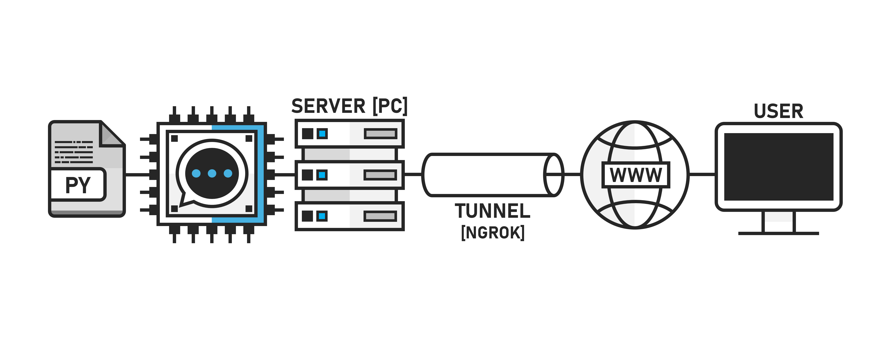

# IEC V2 APP
## Individual Educational Chatbot

This repository, developed by Stefan Pietrusky, is based on the article published at [[1]](https://medium.com/gitconnected/iec-v1-5-individual-educational-chatbot-f859456ec760). In this article, I describe the functionality of an enhanced version (V1.5) of the IEC application. The first version has already been tested and provided important results for improvement. 

The function of controlling the response level of the model used by clicking a button was very well received by the test subjects [[2]](https://arxiv.org/abs/2412.16165). In the extended application, the Gradio framework is no longer used, but the interface is implemented with HTML, CSS and JS. The level prompts have been optimized. The extraction of content has also been optimized. This is an open source project for educational and research purposes.

Unlike IEC V1.5, which only extracted text from URLs and PDFs and answered questions to the LLM via a simple CLI call, IEC V2 forms a fully-fledged RAG pipeline: Extracted content is divided into token chunks, semantically vectorized using Ollama embeddings, and stored in a persistent FAISS index to find only truly relevant text passages per query. The frontend now offers a selection of models and skill levels, checkbox lists for multiple sources, and dynamic content and chat overviews, while on the server side, edge-tts generates high-quality MP3s and integrates them directly into the chat with play/pause buttons. The answers are created promptly for each source, formatted with references, and merged into a consolidated overall answer, and every conversation, including timestamps, files used, and audio files, is logged completely in JSON logs.

## IEC Structure
```mermaid
flowchart TB
  subgraph Frontend
    A[HTML/CSS/JS] -->|HTTP Requests| B(Flask API)
  end

  subgraph Backend
    B --> C[extract_content]
    B --> D[ask_question]
    B --> E[list_models]
    B --> F[list_extractions]
  end

  subgraph Indexierung
    C --> G[Parser (PDF/Web)]
    G --> H[FAISS Index Builder]
    H --> I[(rag_index.faiss)]
  end

  subgraph RAG-Flow
    D --> J[Retrieval via FAISS]
    J --> K[Per‑Source Prompting]
    K --> L[Answer summary]
  end

  subgraph TTS & Logging
    L --> M[edge-tts → MP3]
    L --> O[Conversational-Log (JSON)]
  end

  B -.->|Models| P[ollama CLI]
  B -->|Data storage| DATA_DIR
  B -->|Audio/Logs| CONV_ROOT
```

## IEC working principle
Below is a short GIF showing the structure and function of the app.


## IEC availability
The code to run the app is already in the repository.To make the app available via the Internet and not be restricted to the local network, a tunnel tool such as ngrok must be used! Your own computer becomes the server.



Alternatively, modern Platform-as-a-Service solutions such as Railway can be used to publish the app quickly and easily.

## Installing and running the application 
1. Clone this repository on your local computer: 
```bash 
git clone https://github.com/stefanpietrusky/iecvgit
```
2. Install the required dependencies:
```bash 
pip install -r requirements.txt
```
3. Install [Ollama](https://ollama.com/) and load the default model [Llama3.2](https://ollama.com/library/llama3.2) (3B).
```bash 
ollama pull llama3.2
```
Alternatively, another model can be used.
4. Install the embedding model:
```bash 
ollama pull nomic-embed-text
```
5. Install Python [3.10.11](https://www.python.org/downloads/release/python-31011/).
6. Adjust the Edge TTS [voice](https://gist.github.com/BettyJJ/17cbaa1de96235a7f5773b8690a20462) as needed.
7. Start the IEC app:
```bash 
python app.py
```
## References
[1] Pietrusky, S. (2025). Individual learning support made easy. IEC V1.5: Individual Educational Chatbot. A tool for individual exchange with PDF files and websites. Level Up Coding.

[2] Pietrusky, S. (2024). Promoting AI Literacy in Higher Education: Evaluating the IEC-V1 Chatbot for Personalized Learning and Educational Equity. ARXIV CS.CY
